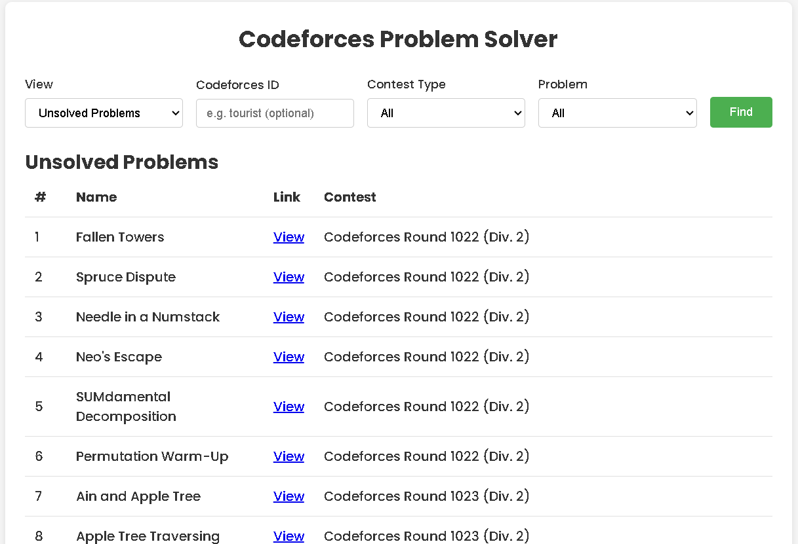

# Codeforces Recent Problem List

This is a simple webpage to help you manage Codeforces problems. It organizes problems into two categories: **Solved** and **Unsolved**.

---

### How It Works:
1. Enter your Codeforces ID.
2. Browse the list of problems fetched from 30 recent contests.
3. Use filters or search to find specific problems.
4. Data are stored in local storage so you don't have to fetch the problem regularly.

---

### Example Views:

---

     
## Deployed Link
https://codeforces-recent-problem-list.vercel.app/
